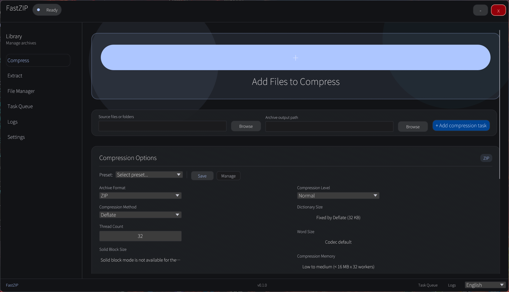

# FastZIP

[English](README.md) | [简体中文](docs/README_zh.md)


A native Rust archive tool with GUI and CLI. Compress, extract, test, and benchmark — all in one binary with no external dependencies for common formats.

## Features

- **Compression & extraction** — 12 output formats with 5 compression levels
- **Archive testing** — stream through entries and verify CRC32 integrity without extracting
- **Performance benchmark** — built-in benchmark suite across all format/level combinations
- **Self-extracting archives** — wrap any archive into a standalone .exe (SFX)
- **AMSI malware scanning** — optional Windows Antimalware Scan Interface integration for extracted files
- **Hash/checksum** — SHA-256, BLAKE3, CRC32 for any file
- **Split volumes** — create and read multi-volume archives (.zip, .7z)
- **Password protection** — AES-encrypted ZIP and 7z archives
- **Codepage handling** — automatic encoding detection for non-UTF-8 filenames (Shift-JIS, GBK, etc.)
- **Pipe support** — read/write archives from stdin/stdout (`-`)
- **Compression presets** — save and reuse compression settings
- **WIM / ISO read-only** — list files inside WIM and ISO 9660 images
- **Windows shell integration** — right-click context menu for compress/extract
- **Localization** — 12 languages (English, Chinese, Japanese, Korean, French, German, Spanish, Italian, Portuguese, Russian, Arabic, Turkish)

## Format support

| Format | Extension | Compress | Extract |
|--------|-----------|----------|---------|
| ZIP | `.zip` | Yes | Yes |
| 7-Zip | `.7z` | Yes | Yes |
| Tar | `.tar` | Yes | Yes |
| Tar + Gzip | `.tar.gz` `.tgz` | Yes | Yes |
| Tar + Bzip2 | `.tar.bz2` `.tbz2` | Yes | Yes |
| Tar + XZ | `.tar.xz` `.txz` | Yes | Yes |
| Tar + Zstd | `.tar.zst` `.tzst` | Yes | Yes |
| Tar + LZ4 | `.tar.lz4` `.tlz4` | Yes | Yes |
| Gzip | `.gz` | Yes | Yes |
| Bzip2 | `.bz2` | Yes | Yes |
| XZ | `.xz` | Yes | Yes |
| Zstd | `.zst` | Yes | Yes |
| LZ4 | `.lz4` | Yes | Yes |
| RAR | `.rar` | No | Yes (via external `unrar.exe`) |
| WIM | `.wim` | No | List only |
| ISO 9660 | `.iso` | No | Yes |

## CLI usage

The main binary includes both GUI and CLI. Use subcommands to access CLI functions.

### Inspect archives

```powershell
fastzip list archive.zip
fastzip list archive.rar --password secret
fastzip list - < archive.tar.gz --format tar.gz
```

### Extract archives

```powershell
fastzip extract archive.zip -o ./output
fastzip extract archive.7z --flat --password secret
fastzip extract archive.zip --scan          # AMSI scan extracted files
fastzip extract archive.zip --codepage 932  # Shift-JIS filenames
```

### Compress files

```powershell
fastzip compress ./folder -o output.zip
fastzip compress ./folder -o output.7z --level maximum
fastzip compress ./folder -o output.zip --sfx            # self-extracting
fastzip compress ./folder -o output.zip --volume 100M    # split volumes
fastzip compress ./folder -o output.7z --password secret --encrypt-file-names
fastzip compress ./folder -o output.tar.zst --threads 4
```

### Test archive integrity

```powershell
fastzip test archive.zip
fastzip test archive.7z --password secret
```

### Hash / checksum

```powershell
fastzip checksum file.dat --algo sha256
fastzip checksum file.dat --algo blake3
fastzip checksum file.dat --algo crc32
```

### Benchmark

```powershell
fastzip benchmark -o ./results
```

### Other commands

```powershell
fastzip formats              # list supported extensions
fastzip backends             # show backend availability
```

A slim CLI-only binary (`fastzip-cli.exe`) is also included for scripting — it skips GUI startup overhead entirely.

## Performance benchmark

FastZIP includes a built-in benchmark that tests every format (ZIP, 7z, TarGz, TarBz2, TarXz, TarZst, TarLz4, Gz, Bz2, Xz, Zst, LZ4) across three compression levels (Fastest, Normal, Maximum) on both compressible and incompressible 1 MB data sets. Results include compression ratio and throughput in MB/s.

Run it from CLI or from the Settings page in the GUI.

## Screenshots



## Build from source

Requirements: Rust toolchain (edition 2024), Windows 10+.

```powershell
git clone https://github.com/cccccyccccc/fastZIP.git
cd fastZIP
cargo build --release
```

The build produces three binaries in `target/release/`:
- `fastzip.exe` — main GUI + CLI
- `fastzip-cli.exe` — slim CLI only
- `sfx-stub.exe` — self-extracting archive stub

## Architecture

```
src/
  archive/
    mod.rs       — shared types, compression/extraction pipeline
    native.rs    — native Rust backend (ZIP, 7z, tar.*, gz, bz2, xz, zst, lz4)
    rar.rs       — RAR adapter (external unrar.exe)
    service.rs   — backend routing facade
    sfx.rs       — self-extracting archive builder
    test.rs      — archive integrity testing
    iso.rs       — ISO 9660 reader
    wim.rs       — WIM metadata reader
  bin/
    fastzip-cli.rs  — slim CLI binary
    sfx-stub.rs     — SFX stub binary
  gui.rs          — egui/eframe native GUI
  amsi.rs         — Windows AMSI integration
  benchmark.rs    — compression benchmark suite
  hash.rs         — SHA-256 / BLAKE3 / CRC32
  encoding.rs     — codepage detection and conversion
  localization.rs — 12-language localization
  settings.rs     — INI settings + compression presets
```

## License

GPL-3.0
